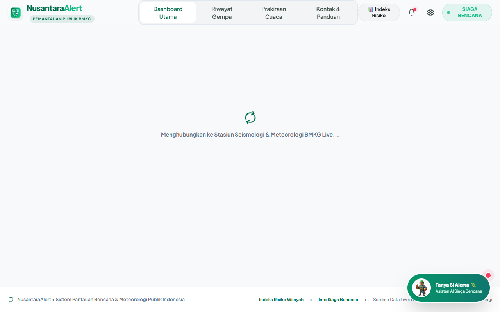
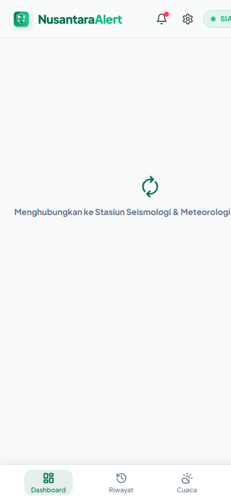
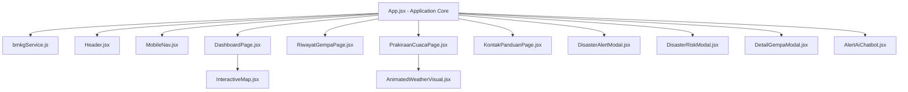

# 📖 Dokumentasi Teknis & Panduan Sistem NusantaraAlert

[](https://nusantara-alert-nine.vercel.app/)
[](https://github.com/Khairul122/NusantaraAlert)
[](./LICENSE)
[](./LICENSE)

Dokumen ini berisi arsitektur sistem, rincian komponen, antarmuka pengguna, serta panduan pengoperasian teknis platform **NusantaraAlert**.

---

## 🖼️ Tangkapan Layar Antarmuka Website (Screenshots)

### 🖥️ 1. Tampilan Desktop (Desktop View)
<p align="center">
  
  <br />
  <i>Tampilan Utama Dashboard Desktop: Peta Episentrum Gempa, Status Tsunami, Laporan Gempa Terkini, Ringkasan Cuaca & Layer Tematik Peta.</i>
</p>

---

### 📱 2. Tampilan Seluler (Mobile View)
<p align="center">
  
  <br />
  <i>Tampilan Seluler (Mobile View): Antarmuka Responsif, Bottom Navigation Bar, dan Akses Cepat Asisten AI Si Alerta.</i>
</p>

---

## 🧩 Arsitektur Modul & Komponen Utama



---

### 📡 1. Modul Integrasi Live Data BMKG TEWS (`src/services/bmkgService.js`)
- **Tugas Utama**: Mengambil data seismik & meteorologi real-time dari stasiun pemantau BMKG tanpa dependensi mock data.
- **Endpoints BMKG**:
  - `https://data.bmkg.go.id/DataMKG/TEWS/autogempa.json` *(Gempa M 5.0+ Terkini)*
  - `https://data.bmkg.go.id/DataMKG/TEWS/gempaterkini.json` *(Arsip 15 Gempa Terbaru)*
  - `https://data.bmkg.go.id/DataMKG/TEWS/gempadirasakan.json` *(Data Skala MMI Dirasakan)*
- **Fungsi Utama**:
  - `fetchLatestEarthquake()`: Mengembalikan objek gempa bumi terbaru.
  - `fetchEarthquakeHistory()`: Mengembalikan daftar riwayat aktivitas seismik.
  - `searchIndonesianLocations(query)`: Geocoding instan nama Kota, Kabupaten, & Provinsi di seluruh Indonesia.
  - `fetchWeatherForCoordinates(lat, lon, name, region)`: Mengambil prakiraan cuaca 5 jam, suhu, kelembapan, angin, radiasi UV, dan kualitas udara.

---

### 🗺️ 2. Modul Peta Interaktif & Layer Tematik (`src/components/InteractiveMap.jsx`)
- **Teknologi**: Leaflet.js & React-Leaflet dengan *smooth map animation* (`map.flyTo`).
- **Layers Tematik**:
  - ⚡ **Overlay Sesar Aktif**: Garis patahan geologi utama (*Sesar Lembang, Sesar Opak, Megathrust Sunda Jawa-Sumatera, Sesar Palu-Koro, Sesar Semangko, Sesar Sorong*).
  - 🏥 **Posko SAR & Rumah Sakit**: Penanda lokasi RS Rujukan Gawat Darurat & Posko SAR (RSUP Cipto, RSUP Hasan Sadikin, RSUP Sardjito, RSUD Soetomo, RSUD Undata Palu).
  - 🌧️ **Citra Radar Hujan Live**: Tile overlay pemantauan hujan real-time.

---

### 🦅 3. Modul Asisten AI Siaga Bencana "Si Alerta" (`src/components/AlertAiChatbot.jsx`)
- **Maskot**: **Si Alerta 🦅** *(3D Pixar-Style Elang Jawa Berhelm Keselamatan Green BMKG)* (`/mascot.png`).
- **Fitur Kecerdasan AI**:
  - **Intent Router Dynamic Weather**: Jika pengguna menanyakan *"info cuaca Lhokseumawe"*, AI otomatis memanggil API Geocoding & Weather BMKG untuk menampilkan suhu, kelembapan, angin, dan UV index secara real-time.
  - **Laporan Gempa Terkini**: Menampilkan detail wilayah, magnitudo, kedalaman, koordinat, dan status evaluasi potensi tsunami.
  - **Protokol Keselamatan**: Panduan taktis *Drop, Cover, Hold On*, tanda awal tsunami, dan isi Tas Siaga Bencana (TSB).

---

### 📊 4. Modul Indeks Risiko Bencana Per Kabupaten/Kota (`src/components/DisasterRiskModal.jsx`)
- **Pencarian Wilayah**: Mesin pencari data risiko geofisika untuk **500+ Kabupaten & Kota** se-Indonesia.
- **Skor Risiko**: Memecah tingkat risiko (Rendah, Sedang, Tinggi) untuk **Gempa Bumi**, **Tsunami**, **Banjir**, **Tanah Longsor**, dan **Gunung Berapi** beserta rekomendasi aksi pencegahan daerah.

---

### 🌤️ 5. Modul Prakiraan Cuaca & Animasi Vector 3D (`src/components/AnimatedWeatherVisual.jsx`)
- **Animasi SVG/CSS Keyframes**:
  - ☀️ **Cerah**: Rotasi sinar matahari (`@keyframes sun-rotate`) & pendaran aura.
  - ⛅ **Cerah Berawan**: Sinar matahari mengintip di balik awan melayang (`@keyframes cloud-float`).
  - ☁️ **Berawan**: Pergerakan awan berlapis (*layered cloud drift*).
  - 🌧️ **Hujan**: Tetesan air hujan jatuh kontinu (`@keyframes rain-drop`).
  - 🌩️ **Hujan Petir**: Kilatan petir berkedip (`@keyframes lightning-flash`).
  - 🌙 **Malam**: Bulan sabit berpendar dengan bintang berkedip (`@keyframes twinkle`).

---

### 📞 6. Modul Panggilan Darurat Direct & Panduan Mitigasi (`src/pages/KontakPanduanPage.jsx`)
- **Direct Dial 24 Jam**: Klik pada nomor darurat langsung mengaktifkan protokol telepon (`tel:115`, `tel:117`, `tel:119`, `tel:110`, `tel:113`, `tel:196`).
- **Tas Siaga Bencana (TSB)**: Daftar periksa (*interactive checklist*) kelengkapan ransel darurat keluarga.

---

### 📱 7. Modul PWA (Progressive Web App) & Service Worker (`public/manifest.json` & `public/sw.js`)
- **PWA Installation**: Mendukung instalasi aplikasi mandiri pada Android/iOS.
- **Offline Caching**: Menyimpan halaman utama dan dokumen panduan keselamatan di memori cache browser sehingga tetap dapat dibaca tanpa internet saat bencana.

---

## 🛠️ Panduan Pemeliharaan & Pengembangan

### Cara Menambah Garis Sesar Baru di Peta
Buka file [`src/components/InteractiveMap.jsx`](file:///d:/projek%20fullstack/NusantaraAlert/src/components/InteractiveMap.jsx) dan tambahkan koordinat pada array `FAULT_LINES`:

```javascript
{
  name: 'Nama Sesar Baru',
  color: '#EF4444',
  weight: 3,
  coords: [
    [lat1, lon1],
    [lat2, lon2]
  ]
}
```

### Cara Menambah Data Risiko Kabupaten Baru
Buka file [`src/components/DisasterRiskModal.jsx`](file:///d:/projek%20fullstack/NusantaraAlert/src/components/DisasterRiskModal.jsx) dan tambahkan objek pada `REGENCY_RISK_DATA`.

---

## 📜 Lisensi & Pengembang

Dikembangkan dan dikelola secara resmi oleh **Synectra Jasa Digital**.  
Dilindungi di bawah **[MIT License](./LICENSE)**.
